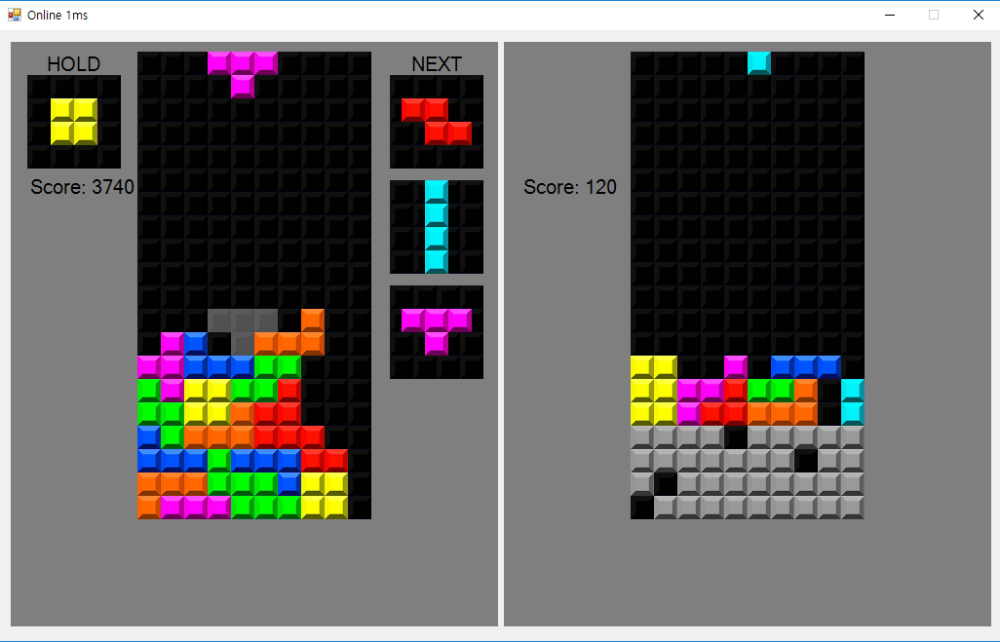

#  Tetris on Multiplay
 Tetris on Multiplay on C# and Node.JS
 
 

# In-Game


The left part is your game.
The right part is another's game.

If you fill blocks on the line,
blocks on the line are broke.

When you break many lines,
blocks appear on the bottom of another's game.

## How to Play
- **A Key** - Move left your block
- **D Key** - Move right your block
- **S Key** - Move down your block
- **Shift Key** - Hold your block
- **Q** - Turn to the direction
- **E** - Turn to opposite direction
- **Space key** Drop your block

# Run
## Client
```bash
Client/Tetris.exe
```
## Server
```bash
node Server index.js
```